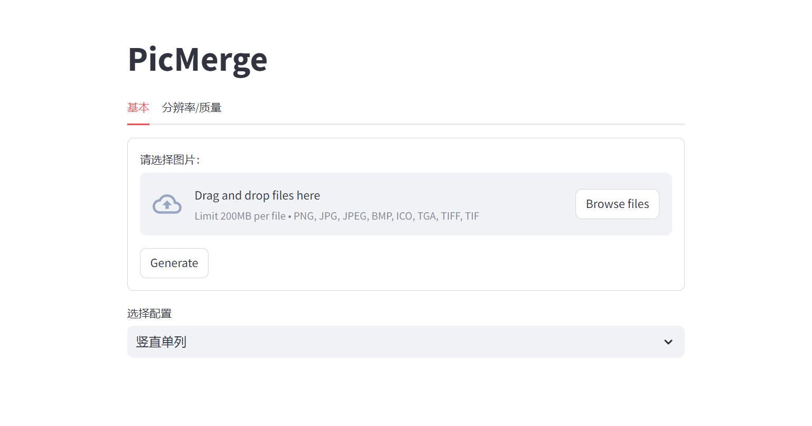
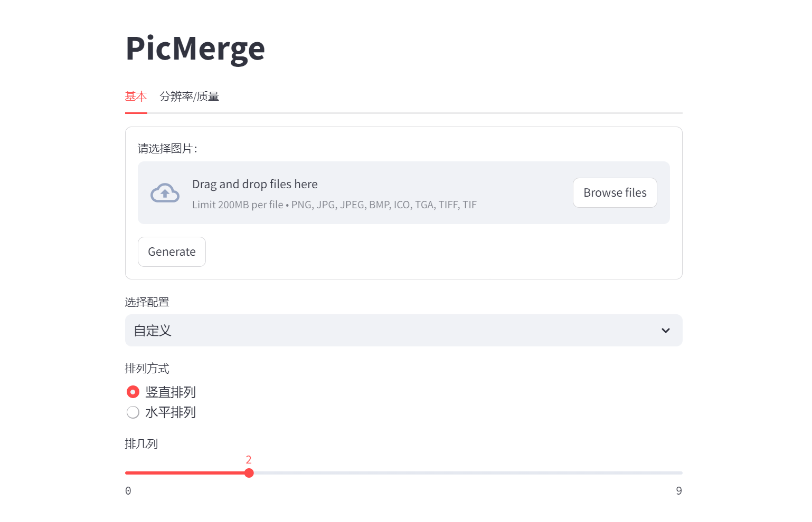
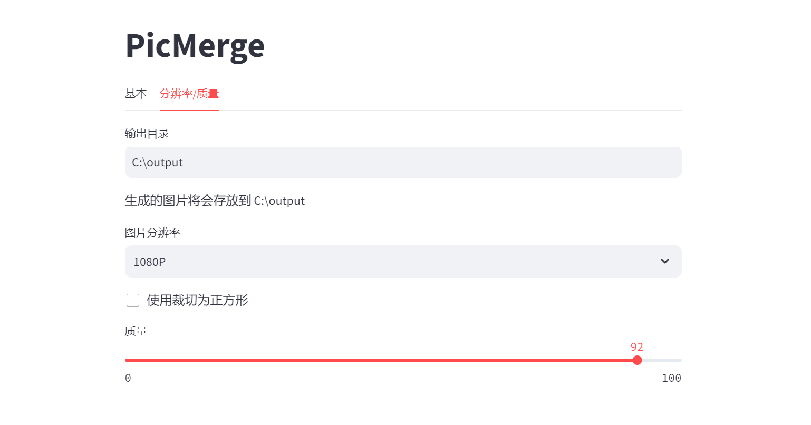

# PicMergeTool

一个简单易用的基于Streamlit和PIL的拼图软件。

允许用户输入多张图片进行拼接，生成一张新的图片。

## 运行环境

Python 3.7

## 使用方法

1. 下载Release
2. 安装依赖`pip install requirements.txt`
3. 运行`streamlit run .\webGUI.py`

## Feature

- 兼容广泛。支持 .png, .jpg, .jpeg, .bmp, .ico, .tga, .tiff
- 支持 水平 和 竖直 排列
- 支持自定义列数/行数
- 支持预设/自定义分辨率
- 支持从EXIF中读取旋转信息进行旋转
- 支持裁切成正方形后拼图

## 界面截图

