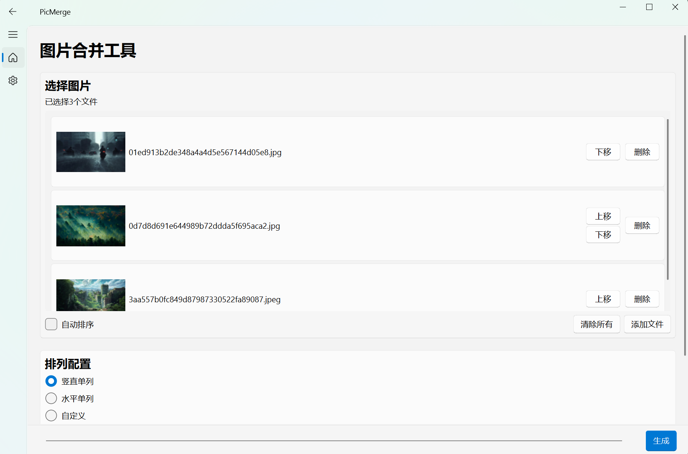
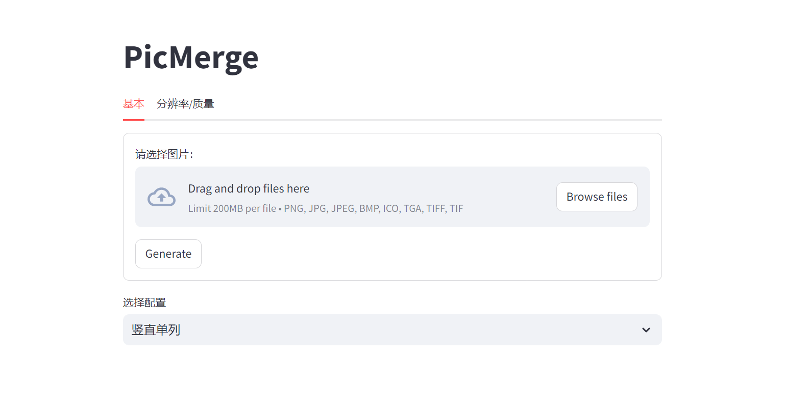
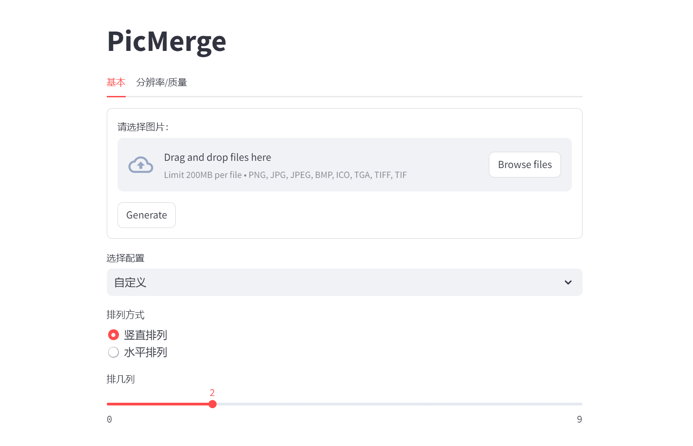
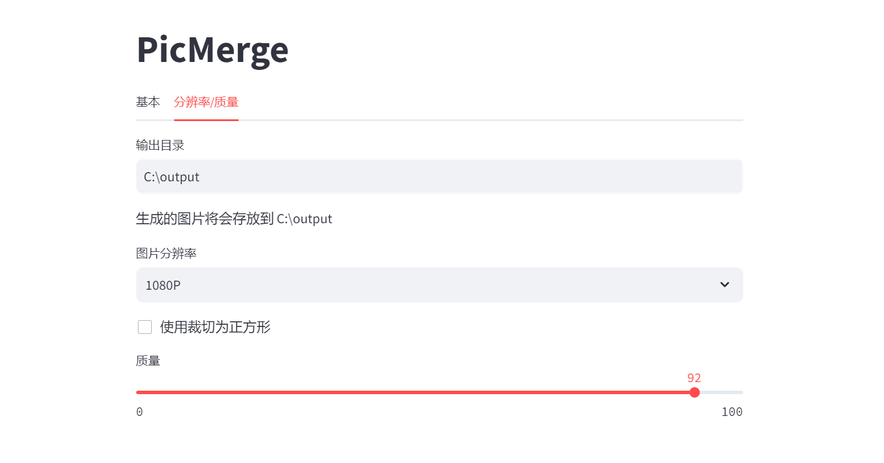

# PicMergeTool

一个简单易用的基于PySide6/Streamlit和PIL的拼图软件。

允许用户输入多张图片进行拼接。

## Feature

- 兼容广泛。支持 .png, .jpg, .jpeg, .bmp, .ico, .tga, .tiff
- 支持 水平 和 竖直 排列，允许自定义列数/行数
- 从EXIF中读取旋转信息进行旋转
- 裁切为正方形后拼图
- 在图片之间添加间隔
- 拖拽/从剪贴板粘贴

## 运行环境

Python 3.7

## 使用

- 使用PySide6界面
  - 下载Release中的与编译版本 或从源码运行
- 使用Streamlit界面
  - 安装依赖`pip install requirements.txt`
  - 运行`streamlit run .\webGUI.py`

## 界面截图（PySide6）

## 界面截图（Streamlit）

